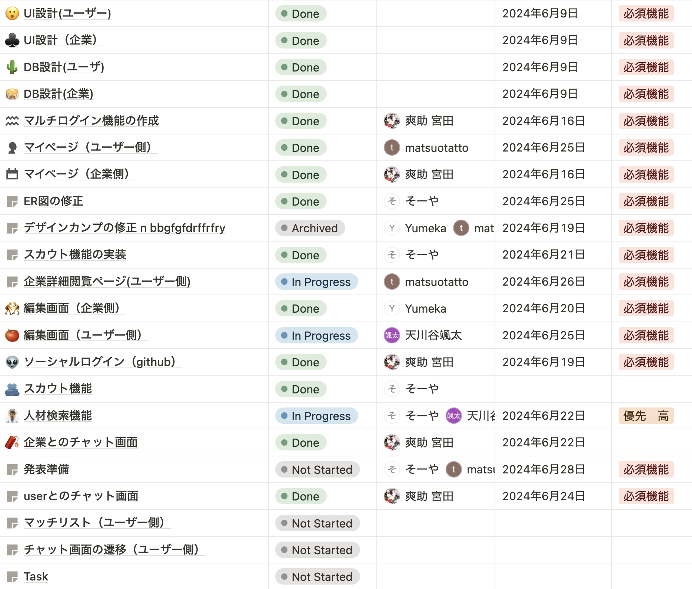

## エンジニア向け勉強記録　＆　企業とのマッチングサイトです


## 使用技術
* PHP (Laravel)
* Tailwind CSS
* HTML, CSS

## タスク管理
* Notion


## 設計・デザインカンプ

### デザインカンプ
https://www.figma.com/design/BTRR7Hxfz1NeovmZmQL0ZQ/UI%E8%A8%AD%E8%A8%88%EF%BC%88%E3%83%87%E3%82%B6%E3%82%A4%E3%83%B3%E3%82%AB%E3%83%B3%E3%83%97%EF%BC%89?node-id=0-1&m=dev&t=Q0EtgcxwSbdYmYvB-1

### 画面遷移図
https://lucid.app/lucidchart/da7b97a4-57b9-49c0-ba74-a2282559e9f8/edit?view_items=sLvIrGNH_hIC&invitationId=inv_34c8f946-6eab-4de0-9d06-c4ddd856e8ef

### データベース設計
https://lucid.app/lucidchart/df49b10e-2941-4960-aa17-4da08d00774e/edit?viewport_loc=-3139%2C-1123%2C3837%2C2388%2C0_0&invitationId=inv_1c23de71-4a53-40cd-a772-091d588a7731


### URL設計（ユーザー側）
https://www.notion.so/f471b59f3ae749c793e4247b26d2615a?v=5cb5244af5e640b39606e2f1fe97d67e&pvs=4
### URL設計（企業側）
https://www.notion.so/URL-7c511fa928de4bf388f012e245a9f325?pvs=4


## 導入方法

１.必要な依存パッケージのインストール
 * ```composer install```
 * ```npm install ```

2.envの作成
.envを作成し、.env.exampleをコピーする

2.データベースを設定して、マイグレーションを行う
 *  ``` php artisan migrate ```

3.ローカルサーバーを起動
* ``` php artisan serve ```
* ``` php run dev ```

4.企業側ログイン方法
* ``` company/login```

5.ユーザー側ログイン方法
* ``` login ```
